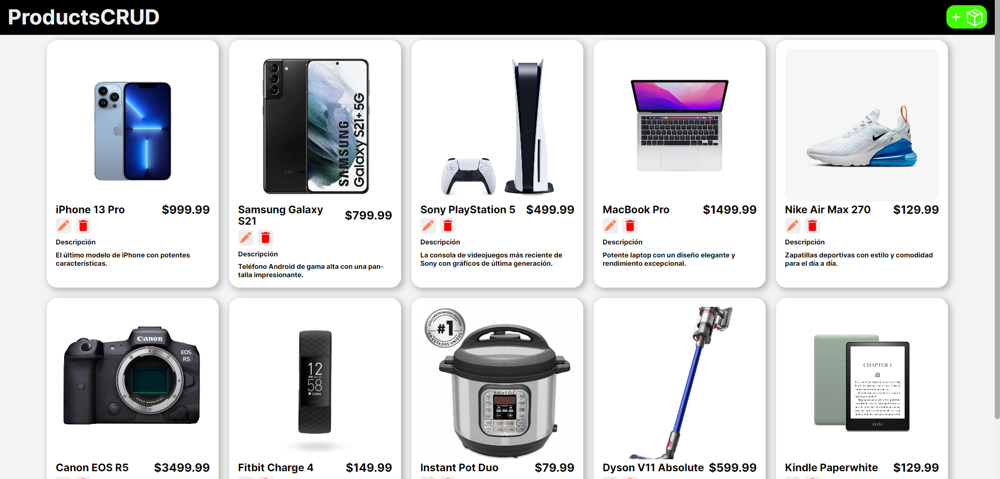
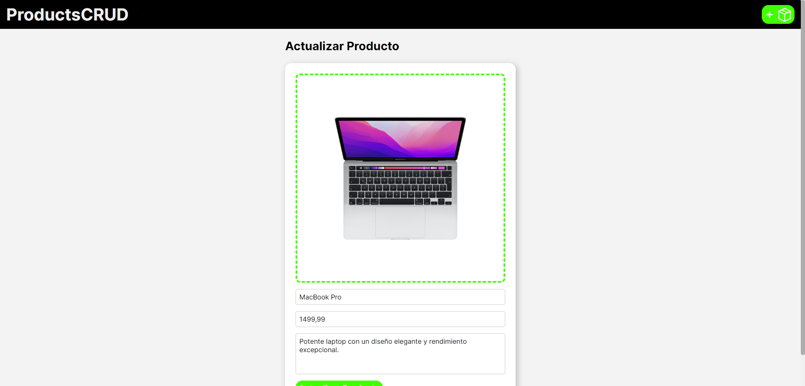
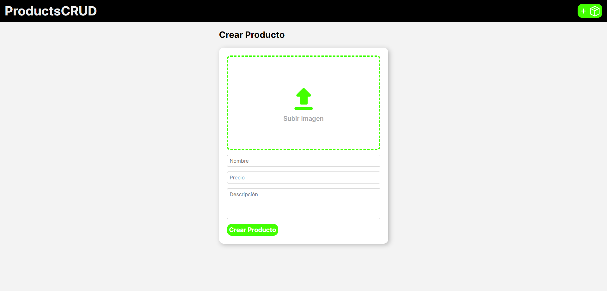

# Product CRUD with Java Spring Boot and React

[](https://spring.io/projects/spring-boot)
[](https://www.oracle.com/java/technologies/javase-jdk11-downloads.html)
[](https://reactjs.org/)
[](https://axios-http.com/)
[](https://www.docker.com/)
[](https://www.gnu.org/licenses/gpl-3.0.en.html)

<p align="center">
  
</p>

<p align="center">
  
</p>

<p align="center">
  
</p>

## Description

This repository contains a basic example of a Product CRUD (Create, Read, Update, Delete) application using Java Spring Boot for the backend and React for the frontend. The CRUD operations allow performing basic actions on a list of products, including creating, reading, updating, and deleting products.

## Requirements

Before you begin, make sure you have the following prerequisites installed:

1. **Docker Desktop**: Used to run containers and manage Docker images. You can download it from [https://www.docker.com/products/docker-desktop](https://www.docker.com/products/docker-desktop).

2. **Maven**: A build and project management tool for Java. Ensure you have Maven installed and configured in your environment. You can get it from [https://maven.apache.org/](https://maven.apache.org/).


## How to Use

1. Clone the repository to your local machine using the following command:

```bash
   git clone https://github.com/Pablo736/Products-CRUD
```

2. Run the file `deploy.sh`:

```bash
   sh deploy.sh
```

3. Open port 3000 in browser: `http://localhost:3000/`

## License
This project is licensed under the GNU General Public License v3.0. See the `LICENSE` file for more details.